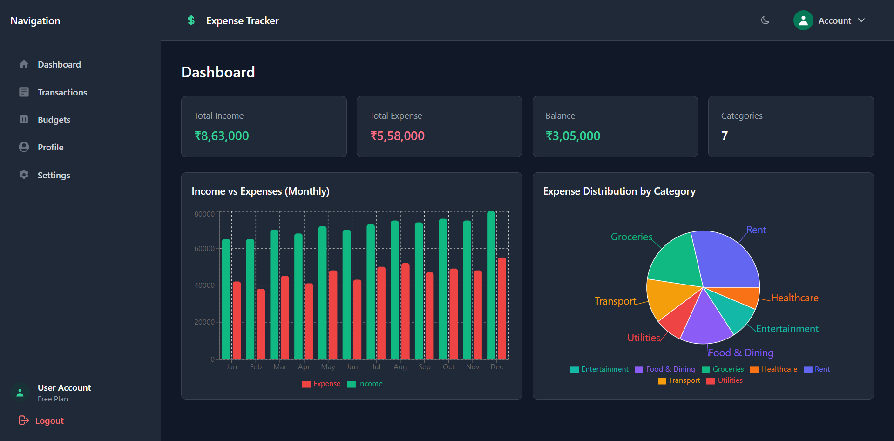
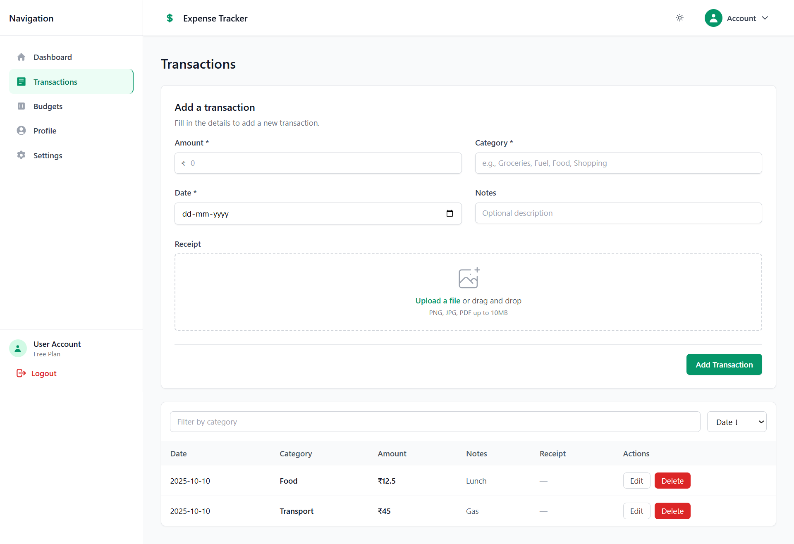
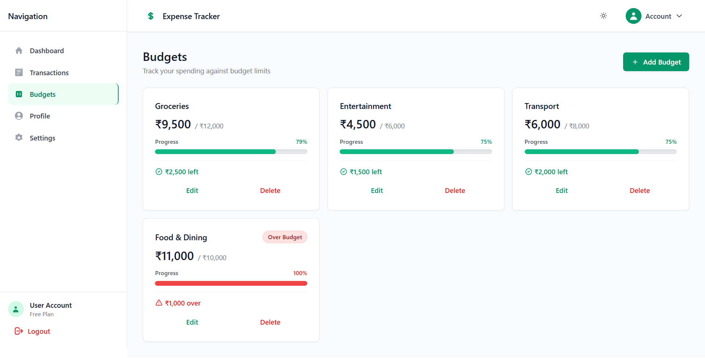
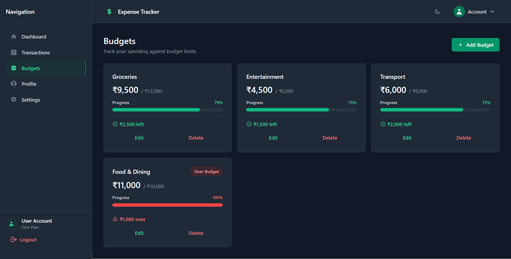
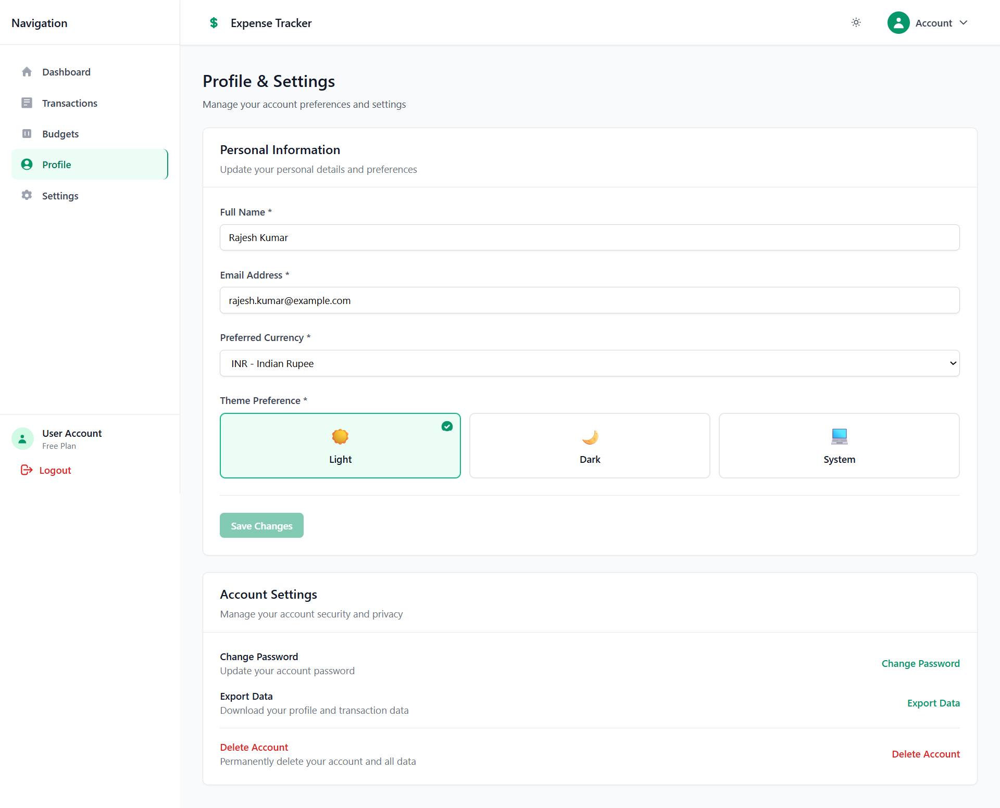
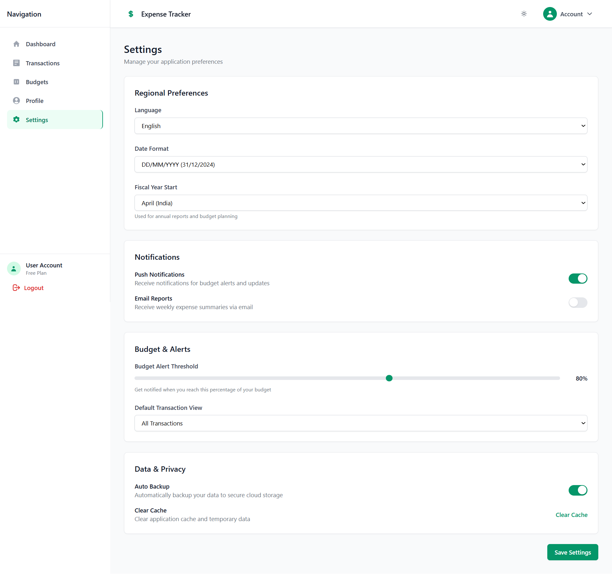
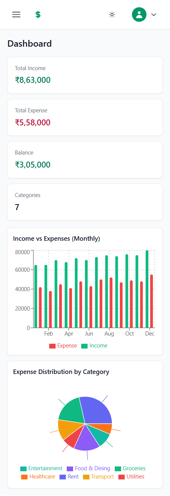
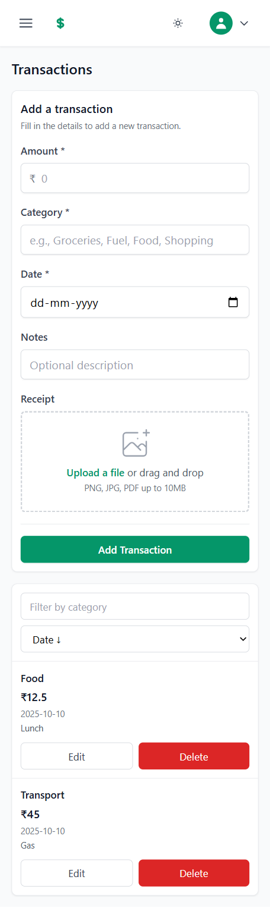
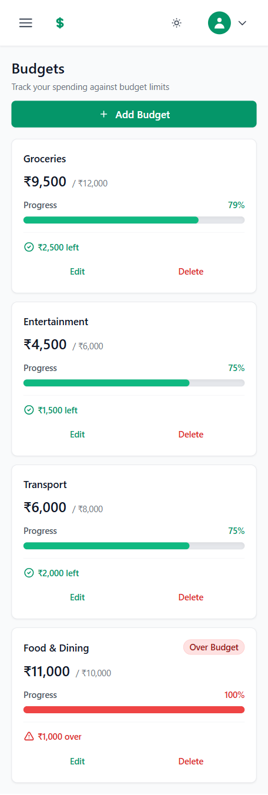
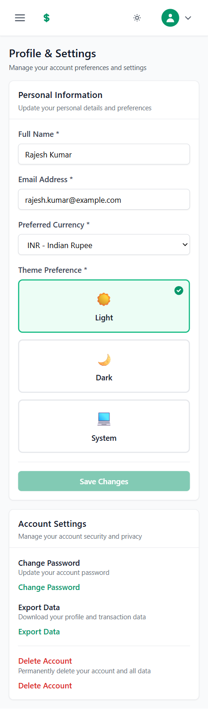

# 💰 Expense Tracker Web App

<div align="center">


A modern, feature-rich expense tracking application built with React and TailwindCSS. Track your expenses, manage budgets, visualize spending patterns, and take control of your finances with an intuitive and responsive interface.

[Features](#-features) • [Demo](#-demo) • [Tech Stack](#-tech-stack) • [Getting Started](#-getting-started) • [Usage](#-usage) • [Contributing](#-contributing)

</div>

---

## ✨ Features

### 📊 **Dashboard Analytics**
- **Real-time Overview**: Get instant insights into your financial status
- **Interactive Charts**: Visualize income vs expenses with beautiful bar charts
- **Expense Distribution**: Pie charts showing spending by category
- **Summary Cards**: Quick view of total income, expenses, balance, and categories

### 💸 **Transaction Management**
- **Easy Entry**: Add transactions with amount, category, date, and notes
- **Receipt Upload**: Attach receipt images or PDFs to transactions
- **Smart Filtering**: Filter transactions by category
- **Flexible Sorting**: Sort by date or amount (ascending/descending)
- **Edit & Delete**: Modify or remove transactions with confirmation
- **Mobile-Optimized**: Card view for mobile, table view for desktop

### 🎯 **Budget Planning**
- **Category Budgets**: Set spending limits for different categories
- **Progress Tracking**: Visual progress bars with color-coded alerts
- **Budget Alerts**: Notifications when approaching or exceeding limits
- **Quick Actions**: Edit or delete budgets with one click
- **Currency Support**: Multiple currency options (INR, USD, EUR, GBP, etc.)

### 👤 **User Profile & Settings**
- **Profile Management**: Update name, email, and preferences
- **Theme Customization**: Choose from Light, Dark, or System theme
- **Currency Selection**: Set your preferred currency
- **Data Export**: Download your data in JSON format
- **Regional Settings**: Language, date format, and fiscal year preferences
- **Notification Controls**: Manage push notifications and email reports
- **Budget Alerts**: Customizable threshold settings

### 🎨 **Design & UX**
- **Fully Responsive**: Optimized for mobile, tablet, and desktop devices
- **Dark Mode**: Beautiful dark theme with seamless transitions
- **Modern UI**: Clean, intuitive interface built with TailwindCSS
- **Smooth Animations**: Polished transitions and interactions
- **Accessibility**: ARIA labels, keyboard navigation, and screen reader support
- **Toast Notifications**: Real-time feedback for user actions

### 🔒 **Authentication & Security**
- **User Authentication**: Secure login and registration
- **Protected Routes**: Route guards for authenticated pages
- **Form Validation**: Client-side validation with Zod schema
- **Error Handling**: Comprehensive error states and messages

---

## 🎬 Demo

Here are some screenshots to give you a glimpse of the Expense Tracker Web App in action.

### Dashboard Overview (Light Theme)
A comprehensive view of your financial health, including monthly income vs. expenses and categorized spending.


### Dashboard Overview (Dark Theme)
The same powerful dashboard with a sleek dark theme for comfortable viewing in low-light conditions.



### Transaction Management
Easily add, edit, and manage all your transactions with an intuitive interface that adapts to your device.



### Budget Tracking
Set budgets for different categories and track your progress with visual indicators and alerts.




### Profile & Settings
Manage your account preferences, theme settings, and personal information with ease.



### Application Settings
Configure regional preferences, notifications, budget alerts, and data privacy settings.



### 📱 Mobile Responsive Design

The Expense Tracker is fully optimized for mobile devices, providing a seamless experience across all screen sizes.

#### Mobile Dashboard
Perfect financial overview that adapts beautifully to mobile screens with touch-friendly interfaces.



#### Mobile Transactions
Easy transaction management on the go with intuitive mobile-first design.



#### Mobile Budgets
Track your budgets with mobile-optimized progress indicators and touch controls.



#### Mobile Profile & Settings
Complete profile management optimized for mobile interaction.



---

## 🛠 Tech Stack

### Frontend Framework
- **React 19.1** - Latest React with concurrent features
- **React Router 7** - Client-side routing and navigation
- **Vite 7** - Lightning-fast build tool and dev server

### UI & Styling
- **TailwindCSS 3.4** - Utility-first CSS framework
- **Custom Components** - Reusable component library
- **Responsive Design** - Mobile-first approach

### Forms & Validation
- **React Hook Form 7** - Performant form management
- **Zod 4** - TypeScript-first schema validation
- **@hookform/resolvers** - Zod integration for forms

### Data Visualization
- **Recharts 3** - Composable charting library
- **Interactive Charts** - Bar charts, pie charts, and more

### State Management
- **React Context API** - Theme and toast management
- **Custom Hooks** - useLocalStorage, useDebounce, useToast
- **Local Storage** - Persistent data storage

### Code Quality
- **ESLint 9** - Code linting and best practices
- **PostCSS** - CSS processing and optimization
- **Autoprefixer** - Automatic vendor prefixing

---

## 🚀 Getting Started

### Prerequisites

Before you begin, ensure you have the following installed:
- **Node.js** (v18 or higher)
- **npm** or **yarn** package manager

### Installation

1. **Clone the repository**
```bash
git clone https://github.com/nikhil2004nk/Expense-Tracker-Web-App.git
cd Expense-Tracker-Web-App
```

2. **Install dependencies**
```bash
npm install
# or
yarn install
```

3. **Start the development server**
```bash
npm run dev
# or
yarn dev
```

4. **Open your browser**
Navigate to `http://localhost:5173`

### Build for Production

```bash
npm run build
# or
yarn build
```

The built files will be in the `dist` directory.

### Preview Production Build

```bash
npm run preview
# or
yarn preview
```

---

## 📖 Usage

### First Time Setup

1. **Register an Account**
   - Navigate to the registration page
   - Fill in your name, email, and password
   - Click "Create account"

2. **Login**
   - Use your credentials to log in
   - You'll be redirected to the dashboard

### Adding Transactions

1. Navigate to the **Transactions** page
2. Fill in the transaction form:
   - Amount (required)
   - Category (required)
   - Date (required)
   - Notes (optional)
   - Receipt (optional)
3. Click **Add Transaction**

### Setting Up Budgets

1. Go to the **Budgets** page
2. Click **Add Budget**
3. Enter category name and budget amount
4. Click **Create Budget**
5. Track progress with visual indicators

### Customizing Settings

1. Navigate to **Settings** or **Profile**
2. Update your preferences:
   - Theme (Light/Dark/System)
   - Currency
   - Language
   - Notification preferences
3. Click **Save Settings**

---

## 📁 Project Structure

```
expense-tracker-web-app/
├── public/                      # Static assets
│   └── data/
│       └── summary.json        # Mock dashboard data
├── src/
│   ├── components/             # Reusable components
│   │   ├── common/            # Common UI components
│   │   │   ├── Loader.jsx     # Loading spinner
│   │   │   ├── Modal.jsx      # Modal dialog
│   │   │   ├── Toast.jsx      # Toast notifications
│   │   │   └── index.js       # Component exports
│   │   ├── transactions/      # Transaction components
│   │   │   ├── TransactionForm.jsx
│   │   │   └── TransactionList.jsx
│   │   ├── Header.jsx         # App header
│   │   ├── Sidebar.jsx        # Navigation sidebar
│   │   ├── ThemeToggle.jsx    # Theme switcher
│   │   └── ToastProvider.jsx  # Toast context provider
│   ├── contexts/              # React contexts
│   │   └── ThemeContext.jsx   # Theme management
│   ├── hooks/                 # Custom hooks
│   │   ├── useDebounce.js     # Debounce hook
│   │   ├── useLocalStorage.js # Local storage hook
│   │   └── useToast.js        # Toast hook
│   ├── pages/                 # Page components
│   │   ├── auth/              # Authentication pages
│   │   │   ├── Login.jsx
│   │   │   └── Register.jsx
│   │   ├── Dashboard.jsx      # Dashboard page
│   │   ├── Transactions.jsx   # Transactions page
│   │   ├── Budgets.jsx        # Budgets page
│   │   ├── Profile.jsx        # Profile page
│   │   └── Settings.jsx       # Settings page
│   ├── routes/                # Route configuration
│   │   └── RequireAuth.jsx    # Protected route wrapper
│   ├── services/              # API services
│   │   ├── auth.js            # Authentication service
│   │   └── transactions.js    # Transactions service
│   ├── utils/                 # Utility functions
│   │   └── currency.js        # Currency formatting
│   ├── App.jsx                # Main app component
│   ├── main.jsx              # App entry point
│   └── index.css             # Global styles
├── index.html                 # HTML template
├── package.json              # Dependencies
├── tailwind.config.ts        # Tailwind configuration
├── vite.config.js            # Vite configuration
├── postcss.config.js         # PostCSS configuration
└── eslint.config.js          # ESLint configuration
```

---

## 🎯 Key Features Explained

### Real-time Theme Synchronization
The app uses React Context API to manage theme state globally. When you toggle the theme from the header, it instantly updates across all pages including the Profile settings, ensuring consistency throughout the app.

### Responsive Design
Every component is built mobile-first:
- **Mobile**: Stacked layouts, card views, full-width buttons
- **Tablet**: Hybrid layouts with optimized spacing
- **Desktop**: Grid layouts, table views, sidebar navigation

### Data Persistence
All data is stored in localStorage, allowing you to:
- Work offline
- Keep data across sessions
- Export data when needed
- No backend required (for demo purposes)

### Form Validation
Robust validation using Zod schemas:
- Type checking
- Custom error messages
- Real-time validation feedback
- Accessible error states

---

## 🤝 Contributing

Contributions are welcome! Here's how you can help:

1. **Fork the repository**
2. **Create a feature branch**
   ```bash
   git checkout -b feature/AmazingFeature
   ```
3. **Commit your changes**
   ```bash
   git commit -m 'Add some AmazingFeature'
   ```
4. **Push to the branch**
   ```bash
   git push origin feature/AmazingFeature
   ```
5. **Open a Pull Request**

### Development Guidelines

- Follow the existing code style
- Write meaningful commit messages
- Add comments for complex logic
- Test on multiple screen sizes
- Ensure accessibility standards

---

## 🐛 Known Issues & Future Enhancements

### Known Issues
- None currently reported

### Planned Features
- [ ] Backend integration with REST API
- [ ] Real authentication with JWT
- [ ] Advanced analytics and reports
- [ ] Export to PDF/Excel
- [ ] Recurring transactions
- [ ] Multi-currency conversion
- [ ] Category customization
- [ ] Transaction search
- [ ] Data backup to cloud
- [ ] Mobile app (React Native)

---

## 📝 License

This project is licensed under the MIT License - see the [LICENSE](LICENSE) file for details.

---

## 👨‍💻 Author

**Nikhil Kushwaha**

- GitHub: [@nikhil2004nk](https://github.com/nikhil2004nk)
- LinkedIn: [linkedin.com/in/nikhil-kushwaha12](https://www.linkedin.com/in/nikhil-kushwaha12)
- Email: Nikdocuments12@gmail.com

---

## 🙏 Acknowledgments

- [React](https://react.dev/) - UI Framework
- [Vite](https://vitejs.dev/) - Build Tool
- [TailwindCSS](https://tailwindcss.com/) - Styling
- [Recharts](https://recharts.org/) - Charts
- [React Hook Form](https://react-hook-form.com/) - Forms
- [Zod](https://zod.dev/) - Validation

---

## 📞 Support

If you have any questions or need help, feel free to:
- Open an issue
- Start a discussion
- Reach out via email

---

<div align="center">

**⭐ Star this repo if you find it helpful!**

Made with ❤️ by [Nikhil Kushwaha](https://github.com/nikhil2004nk)

</div>
